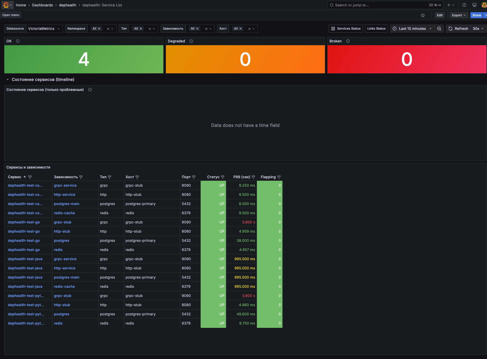
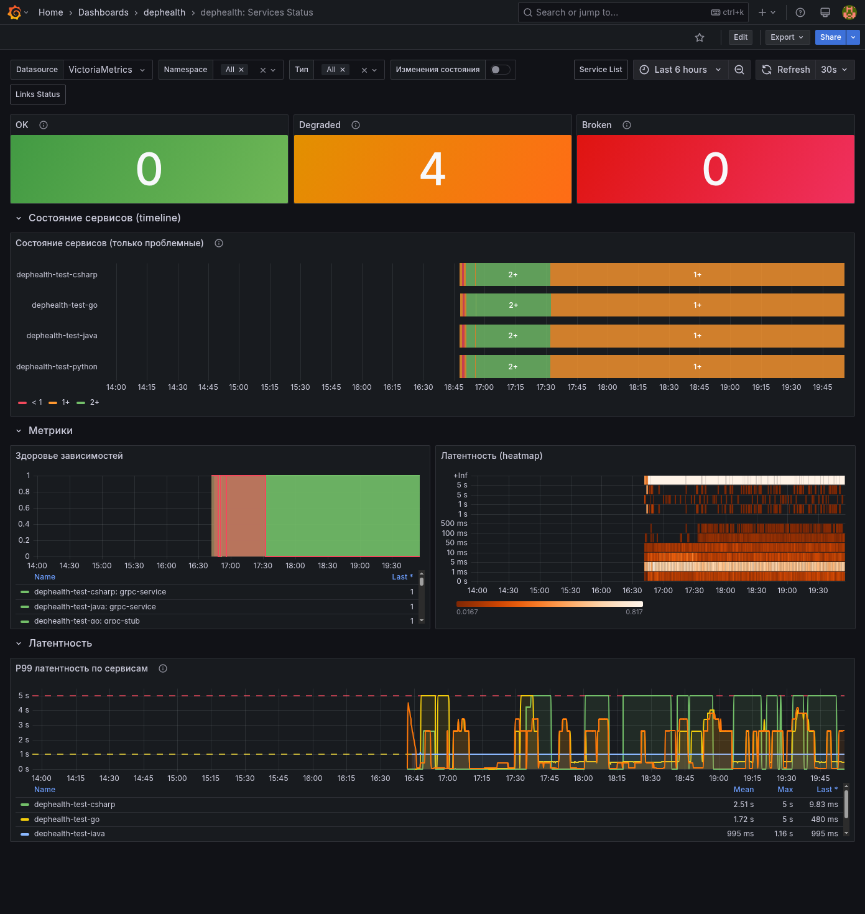
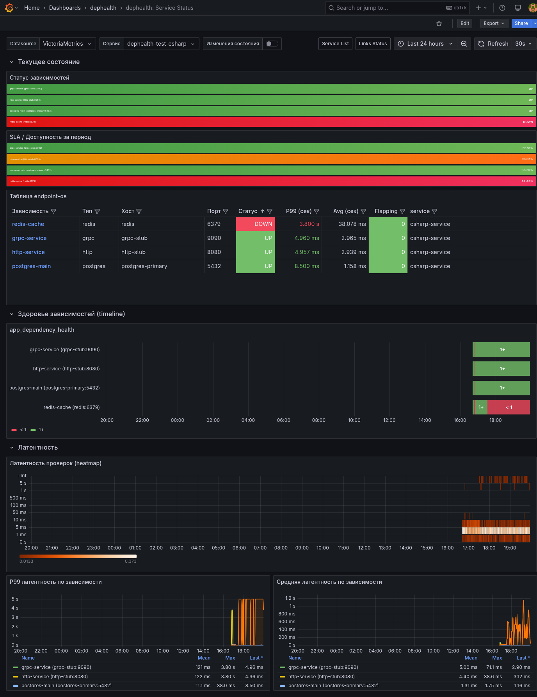
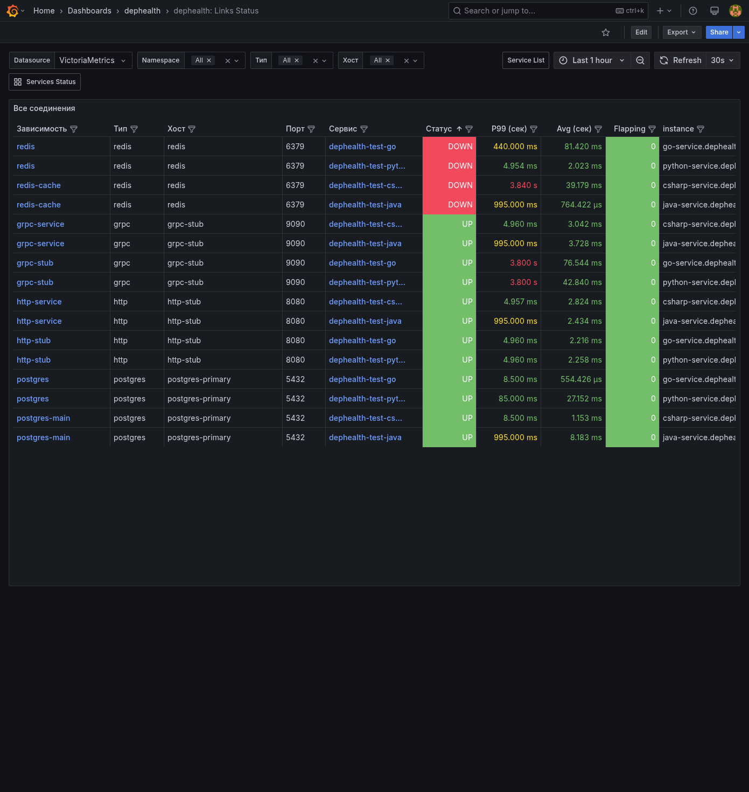
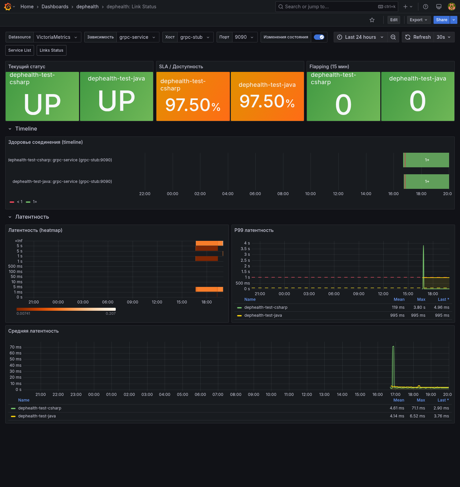

*[English version](grafana-dashboards.md)*

# Grafana дашборды dephealth

Набор из 5 дашбордов для мониторинга состояния зависимостей микросервисов. Дашборды связаны между собой ссылками и drill-down переходами, образуя единую систему навигации от общего обзора до деталей конкретного соединения.

## Обзор

| Название | Описание | UID | Путь |
| --- | --- | --- | --- |
| Service List | Главный обзор: все сервисы и их зависимости | `dephealth-service-list` | `/d/dephealth-service-list/` |
| Services Status | Состояние системы во времени: timeline, графики, heatmap | `dephealth-services-status` | `/d/dephealth-services-status/` |
| Service Status | Детальный статус зависимостей выбранного сервиса | `dephealth-service-status` | `/d/dephealth-service-status/` |
| Links Status | Таблица всех соединений с метриками | `dephealth-links-status` | `/d/dephealth-links-status/` |
| Link Status | Подробная информация о конкретном соединении | `dephealth-link-status` | `/d/dephealth-link-status/` |

## Навигация между дашбордами

```text
Service List (обзор)
  |
  +---> Services Status (timeline всех сервисов)
  |       |
  |       +---> Service Status (один сервис)
  |               |
  |               +---> Link Status (одно соединение)
  |
  +---> Links Status (таблица всех соединений)
          |
          +---> Link Status (одно соединение)
```

Переходы осуществляются через ссылки в заголовке дашборда и кликабельные значения в таблицах.

## 1. Service List

**Назначение**: главный обзор всех сервисов и их зависимостей. Точка входа в систему мониторинга.



### Панели

- **OK / Degraded / Broken** (stat) -- три счётчика сервисов по состоянию:
  - OK (зелёный) -- все зависимости сервиса доступны
  - Degraded (оранжевый) -- часть зависимостей недоступна
  - Broken (красный) -- все зависимости недоступны
- **Состояние сервисов (timeline)** -- state-timeline только проблемных сервисов за выбранный период. Значения: OK=2, Degraded=1, Broken=0. Клик по сервису ведёт на Service Status
- **Сервисы и зависимости** (таблица) -- полный список зависимостей с колонками:
  - Сервис -- имя сервиса (ссылка на Service Status)
  - Зависимость -- имя зависимости (ссылка на Link Status)
  - Тип -- тип зависимости (http, grpc, postgres, redis и т.д.)
  - Хост, Порт -- адрес зависимости
  - Статус -- UP (зелёный) / DOWN (красный)
  - P99 (сек) -- 99-й перцентиль латентности (цвет: зелёный < 100ms, жёлтый < 1s, красный >= 1s)
  - Flapping -- количество смен состояния за 15 минут (цвет: зелёный < 4, оранжевый < 8, красный >= 8)

### Фильтры

- **Datasource** -- источник данных Prometheus/VictoriaMetrics
- **Namespace** -- фильтр по Kubernetes namespace (multi-select)
- **Тип** -- фильтр по типу зависимости (multi-select)
- **Зависимость** -- фильтр по имени зависимости (multi-select)
- **Хост** -- фильтр по хосту (multi-select)

### Навигация

- Ссылки в заголовке: Services Status, Links Status
- Клик по сервису в таблице: переход на Service Status
- Клик по зависимости в таблице: переход на Link Status

## 2. Services Status

**Назначение**: состояние всей системы на промежутке времени -- timeline всех сервисов, графики здоровья, heatmap и P99 латентности.



### Панели

- **OK / Degraded / Broken** (stat) -- счётчики сервисов по состоянию (аналогично Service List)
- **Состояние сервисов (timeline)** -- state-timeline проблемных сервисов. Клик по сервису ведёт на Service Status
- **Здоровье зависимостей** (timeseries) -- график app_dependency_health по каждой зависимости (0/1). Клик ведёт на Link Status. Легенда в виде таблицы
- **Латентность (heatmap)** -- тепловая карта распределения латентности проверок
- **P99 латентность по сервисам** (timeseries) -- 99-й перцентиль латентности по сервисам. Пороги: > 1s -- warning (жёлтый), > 5s -- critical (красный). Клик ведёт на Service Status. Легенда: Mean, Max, Last

### Фильтры

- **Datasource** -- источник данных
- **Namespace** -- Kubernetes namespace (multi-select)
- **Тип** -- тип зависимости (multi-select)

### Навигация

- Ссылки в заголовке: Service List, Links Status
- Клик по сервису в timeline: переход на Service Status
- Клик по зависимости в графике здоровья: переход на Link Status
- Клик по сервису в P99 графике: переход на Service Status

## 3. Service Status

**Назначение**: детальный статус зависимостей выбранного сервиса -- текущее состояние, SLA, таблица endpoint-ов, timeline и латентность.



### Панели

- **Статус зависимостей** (stat) -- текущее состояние каждой зависимости сервиса: UP/DOWN с цветовой индикацией. Клик ведёт на Link Status
- **SLA / Доступность за период** (stat) -- процент доступности каждой зависимости за выбранный период. Пороги: < 95% -- красный, 95-99% -- оранжевый, >= 99% -- зелёный
- **Таблица endpoint-ов** (table) -- все зависимости сервиса с колонками: Зависимость (ссылка на Link Status), Тип, Хост, Порт, Статус, P99 (сек), Avg (сек), Flapping
- **app_dependency_health (timeline)** -- state-timeline здоровья каждой зависимости (UP/DOWN). Клик ведёт на Link Status
- **Латентность проверок (heatmap)** -- тепловая карта распределения латентности
- **P99 латентность по зависимости** (timeseries) -- 99-й перцентиль по каждой зависимости. Легенда: Mean, Max, Last
- **Средняя латентность по зависимости** (timeseries) -- средняя латентность по каждой зависимости. Легенда: Mean, Max, Last

### Фильтры

- **Datasource** -- источник данных
- **Сервис** -- выбор конкретного сервиса (single-select)

### Навигация

- Ссылки в заголовке: Service List, Links Status
- Клик по stat-панели зависимости: переход на Link Status
- Клик по зависимости в таблице: переход на Link Status
- Клик по зависимости в timeline: переход на Link Status

## 4. Links Status

**Назначение**: единая таблица всех соединений в системе с метриками статуса, латентности и flapping.



### Панели

- **Все соединения** (table) -- полная таблица всех соединений с колонками:
  - Зависимость -- имя зависимости (ссылка на Link Status)
  - Тип -- тип зависимости
  - Хост -- адрес хоста
  - Порт -- номер порта
  - Сервис -- имя сервиса (ссылка на Service Status)
  - Статус -- UP (зелёный) / DOWN (красный)
  - P99 (сек) -- 99-й перцентиль латентности
  - Avg (сек) -- средняя латентность
  - Flapping -- количество смен состояния за 15 минут

Таблица отсортирована по статусу (DOWN сверху), все колонки фильтруемые.

### Фильтры

- **Datasource** -- источник данных
- **Namespace** -- Kubernetes namespace (multi-select)
- **Тип** -- тип зависимости (multi-select)
- **Хост** -- фильтр по хосту (multi-select)

### Навигация

- Ссылки в заголовке: Service List, Services Status
- Клик по зависимости: переход на Link Status
- Клик по сервису: переход на Service Status

## 5. Link Status

**Назначение**: подробная информация о конкретном соединении -- статус, SLA, flapping, timeline, heatmap и латентность по каждому сервису, использующему это соединение.



### Панели

- **Текущий статус** (stat) -- UP/DOWN по каждому сервису, использующему эту зависимость
- **SLA / Доступность** (stat) -- процент доступности за выбранный период по каждому сервису. Пороги: < 95% -- красный, 95-99% -- оранжевый, >= 99% -- зелёный
- **Flapping (15 мин)** (stat) -- количество смен состояния за 15 минут по каждому сервису. Пороги: < 4 -- зелёный, 4-8 -- оранжевый, >= 8 -- красный
- **Здоровье соединения (timeline)** -- state-timeline UP/DOWN по каждому сервису
- **Латентность (heatmap)** -- тепловая карта распределения латентности проверок
- **P99 латентность** (timeseries) -- 99-й перцентиль по каждому сервису. Пороги: > 100ms -- жёлтый, > 1s -- красный. Легенда: Mean, Max, Last
- **Средняя латентность** (timeseries) -- средняя латентность по каждому сервису. Легенда: Mean, Max, Last

### Аннотации

На дашборде включены аннотации изменения состояния -- красные маркеры на графиках в моменты смены UP/DOWN.

### Фильтры

- **Datasource** -- источник данных
- **Зависимость** -- имя зависимости (single-select)
- **Хост** -- адрес хоста (single-select)
- **Порт** -- номер порта (single-select)

### Навигация

- Ссылки в заголовке: Service List, Links Status

## Деплой и обновление

Дашборды поставляются как часть Helm chart `dephealth-monitoring` и автоматически провижонятся в Grafana через ConfigMap.

### Обновление дашбордов

```bash
# Обновить Helm release
helm upgrade dephealth-monitoring deploy/helm/dephealth-monitoring/ \
  -f deploy/helm/dephealth-monitoring/values-homelab.yaml \
  -n dephealth-monitoring

# Перезапустить Grafana для применения обновлённых ConfigMap
kubectl rollout restart deployment/grafana -n dephealth-monitoring
```

### Доступ

- **URL**: значение `grafana.rootUrl` из values (по умолчанию `http://grafana.dephealth.local`)
- **Логин**: значение `grafana.adminUser` (по умолчанию `admin`)
- **Пароль**: значение `grafana.adminPassword` (по умолчанию `dephealth`)

### Расположение исходников дашбордов

```text
deploy/helm/dephealth-monitoring/dashboards/
  service-list.json
  services-status.json
  service-status.json
  links-status.json
  link-status.json
```
